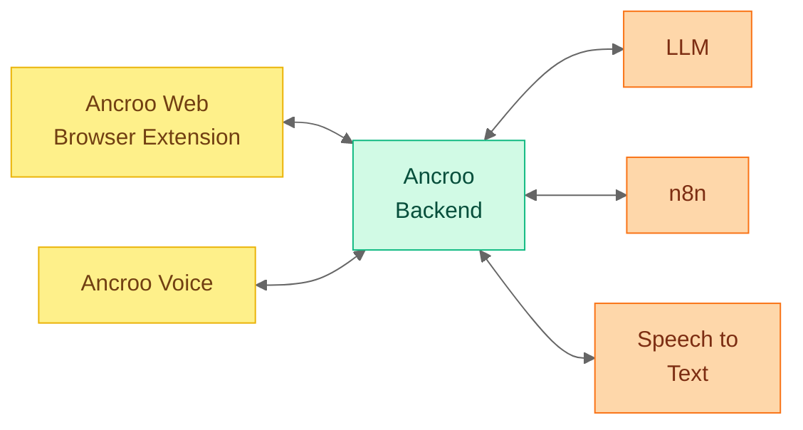
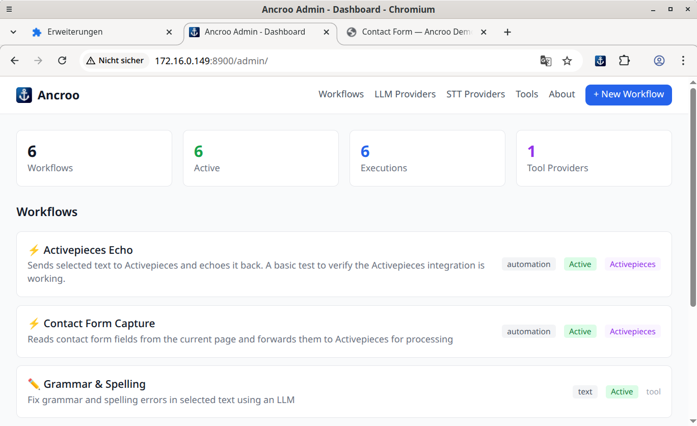

#  Ancroo Backend

[](LICENSE)
[](https://www.python.org/)
[](https://fastapi.tiangolo.com/)
[]()

> **Early stage** — Ancroo Backend is under active development and intended for local/trusted networks only. Do not expose to the public internet without security measures.

The backend service that powers the [Ancroo browser extension](https://github.com/ancroo/ancroo-web). It receives text (or audio) from the extension, runs it through an AI workflow, and sends the result back — all self-hosted on your own machine or server.

## How It Works



## What it does

Ancroo Backend runs **AI workflows** that the browser extension triggers. You select text in any website, press a shortcut, and the extension sends that text to the server. The server processes it with a local AI model and returns the result directly to your browser.



**Example workflows (imported via admin API):**

| Workflow             | What it does                                                              | Requires      |
| -------------------- | ------------------------------------------------------------------------- | ------------- |
| Grammar & Spelling   | Fixes grammar and spelling in selected text using a local LLM             | Ollama        |
| Grammar Fix (CUDA)   | Grammar fix variant for NVIDIA GPU acceleration                           | Ollama (CUDA) |
| Grammar Fix (ROCm)   | Grammar fix variant for AMD GPU acceleration                              | Ollama (ROCm) |
| Speech to Text       | Transcribes audio using the configured STT provider (Speaches or Whisper) | Whisper STT   |
| Contact Form Capture | Captures form fields and triggers an n8n automation workflow              | n8n           |
| Name Formatter       | Extracts name fields from a page and triggers an n8n automation workflow  | n8n           |
| n8n Echo             | Sends selected text to n8n and echoes it back (integration test)          | n8n           |

GPU variant workflows are provided so you can match the grammar workflow to your hardware. For speech-to-text, configure the appropriate STT provider (Speaches for CUDA, Whisper-ROCm for AMD) in the admin UI — a single workflow covers all setups.

Workflows are not hardcoded — the backend is a generic workflow execution engine. You can create custom workflows via the admin UI that target any HTTP endpoint, LLM provider, STT provider, or n8n webhook.

The server connects to AI services you already run locally — primarily [Ollama](https://ollama.com) for text and [Whisper](https://github.com/openai/whisper) for audio. Nothing leaves your network.

## Requirements

- **Docker** and **Docker Compose** (v2)
- **Ollama** running locally with at least one model pulled (e.g. `ollama pull llama3.2`)
- A machine with at least 8 GB RAM (more if running larger models)

## Installation

### Ancroo Stack Module

Deploy Ancroo Backend as a module of [Ancroo Stack](https://github.com/ancroo/ancroo-stack). This integrates it with the shared PostgreSQL database, Ollama, Whisper STT, and optional SSO.

From the **ancroo-backend** directory, run the install script and point it to your Ancroo Stack installation:

```bash
./install-stack.sh /path/to/ancroo-stack
```

This symlinks the module directory into `modules/ancroo-backend/` and optionally enables the module right away.

**Manual enable (if you skipped it during install):**

```bash
cd /path/to/ancroo-stack
./module.sh enable ancroo-backend
```

**What happens during enable:**

1. Environment variables are added to `.env` (ports, database, service URLs)
2. `ANCROO_SECRET_KEY` is auto-generated
3. n8n API key is configured (auto-detected from the n8n module, or prompted manually)
4. Whisper-ROCm URL is auto-detected if the `whisper-rocm` module is enabled
5. The `ancroo` database is created in the shared PostgreSQL
6. The container is pulled from ghcr.io and started

**Post-installation:**

Example workflows are imported via the admin API — either by the meta-installer
(`ancroo/install.sh`) or manually through the admin GUI (**Admin → Import
Workflow**).  Required providers (Ollama, Whisper, n8n) are created
automatically during import.

To add more workflows, use the admin UI at `<server-url>/admin/workflows/new`
or import a `metadata.json` file:

```bash
curl -X POST http://localhost:8900/admin/api/import-workflow \
  -H "Content-Type: application/json" \
  -d @workflow.json
```

**Uninstall:**

```bash
cd /path/to/ancroo-stack
./module.sh disable ancroo-backend
rm -rf modules/ancroo-backend/
```

---

## Configuring the AI model

By default, Ancroo Backend connects to Ollama at `http://ollama:11434` and uses whatever model you configured in `.env`. To change the model used for grammar correction:

1. Open the API docs at `<server-url>/api/docs`
2. Use the `PUT /api/v1/admin/workflows/grammar-fix/llm-provider` endpoint to assign a different model

Or via the command line:

```bash
curl -X PUT http://localhost:8900/api/v1/admin/workflows/grammar-fix/llm-provider \
  -H "Content-Type: application/json" \
  -d '{"llm_provider_id": "<your-provider-id>", "llm_model": "llama3.2"}'
```

## Configuration reference

All settings are loaded from the `.env` file. Only `SECRET_KEY` and `DATABASE_URL` (or `POSTGRES_PASSWORD` when using the bundled database) are required.

| Variable                    | Required | Default                           | Description                                                                                                                   |
| --------------------------- | -------- | --------------------------------- | ----------------------------------------------------------------------------------------------------------------------------- |
| `SECRET_KEY`                | Yes      | —                                 | Random secret string for session security                                                                                     |
| `DATABASE_URL`              | Yes\*    | —                                 | PostgreSQL connection string (alternative to bundled DB)                                                                      |
| `POSTGRES_PASSWORD`         | Yes\*    | —                                 | Password for the bundled PostgreSQL container                                                                                 |
| `N8N_URL`                   | No       | `http://n8n:5678`                 | n8n automation platform URL                                                                                                   |
| `N8N_API_KEY`               | No       | —                                 | n8n API key for workflow integration                                                                                          |
| `OLLAMA_BASE_URL`           | No       | `http://ollama:11434`             | Ollama instance URL                                                                                                           |
| `OLLAMA_DEFAULT_MODEL`      | No       | `mistral:7b`                      | Default LLM model name                                                                                                        |
| `OLLAMA_CUDA_BASE_URL`      | No       | —                                 | Ollama instance URL for NVIDIA GPU                                                                                            |
| `OLLAMA_CUDA_DEFAULT_MODEL` | No       | `mistral:7b`                      | Default model for CUDA Ollama                                                                                                 |
| `OLLAMA_ROCM_BASE_URL`      | No       | —                                 | Ollama instance URL for AMD GPU                                                                                               |
| `OLLAMA_ROCM_DEFAULT_MODEL` | No       | `mistral:7b`                      | Default model for ROCm Ollama                                                                                                 |
| `WHISPER_BASE_URL`          | No       | `http://speaches:8000`            | Speaches instance URL (internal container port is 8000)                                                                       |
| `WHISPER_MODEL`             | No       | `Systran/faster-whisper-large-v3` | Model passed to Speaches per request — Speaches loads it dynamically from HuggingFace                                         |
| `WHISPER_ROCM_BASE_URL`     | No       | —                                 | Whisper-ROCm instance URL for AMD GPU                                                                                         |
| `WHISPER_ROCM_MODEL`        | No       | `openai/whisper-large-v3-turbo`   | Model loaded by Whisper-ROCm **at startup** — must match the server's configured model; changing requires a container restart |
| `AUTH_ENABLED`              | No       | `false`                           | Enable OIDC/Keycloak authentication                                                                                           |
| `ANCROO_BACKENDS`           | No       | `cuda`                            | Comma-separated list of GPU backends to provision workflows for (`cuda`, `rocm`)                                              |
| `CORS_ORIGINS`              | No       | `["chrome-extension://"]`         | JSON array of allowed CORS origins                                                                                            |
| `CORS_EXTENSION_IDS`        | No       | `[]`                              | Restrict to specific Chrome extension IDs; empty allows all (dev mode)                                                        |
| `MAX_UPLOAD_SIZE_MB`        | No       | `200`                             | Maximum file upload size in MB                                                                                                |
| `SSL_VERIFY`                | No       | `true`                            | Verify SSL certificates for outgoing requests                                                                                 |

\*Either `DATABASE_URL` or `POSTGRES_PASSWORD` is required depending on your setup.

## For developers

- **Swagger UI:** `<server-url>/api/docs` — full interactive API documentation
- **Admin GUI:** `<server-url>/admin` — manage workflows, providers, and settings
- **API Reference:** [docs/api.md](docs/api.md) — all endpoints at a glance

**Local development setup:**

```bash
python -m venv venv && source venv/bin/activate
pip install -r packages/backend/requirements.txt
cd packages/backend
alembic upgrade head
uvicorn src.main:app --reload
```

## Contributing

Contributions are welcome! Feel free to open an [issue](https://github.com/ancroo/ancroo-backend/issues) or submit a pull request.

## Security

To report a security vulnerability, please use [GitHub's private vulnerability reporting](https://github.com/ancroo/ancroo-backend/security/advisories/new) instead of opening a public issue.

## Acknowledgments

This project is built with the following open-source software:

| Project | Purpose | License |
|---------|---------|---------|
| [FastAPI](https://fastapi.tiangolo.com/) | Web framework | MIT |
| [SQLAlchemy](https://www.sqlalchemy.org/) | Database ORM | MIT |
| [Alembic](https://alembic.sqlalchemy.org/) | Database migrations | MIT |
| [Pydantic](https://docs.pydantic.dev/) | Data validation | MIT |
| [PostgreSQL](https://www.postgresql.org/) | Database | PostgreSQL License |

Ancroo Backend integrates with these external services (running in their own containers):

| Service | Purpose | License |
|---------|---------|---------|
| [Ollama](https://ollama.com/) | Local LLM inference | MIT |
| [OpenAI Whisper](https://github.com/openai/whisper) | Speech recognition models | MIT |
| [Speaches](https://github.com/speaches-ai/speaches) | Whisper API server (CUDA) | MIT |
| [n8n](https://n8n.io/) | Workflow automation | [Sustainable Use License](https://github.com/n8n-io/n8n/blob/master/LICENSE.md) |

## License

AGPLv3 — see [LICENSE](LICENSE). The Ancroo name is not covered by this license and remains the property of the author.

## Author

**Stefan Schmidbauer** — [GitHub](https://github.com/Stefan-Schmidbauer)

---

Built with the help of AI ([Claude](https://claude.ai) by Anthropic).
